# プロジェクト概要
Terraformを用いてAWS環境でのインフラを構成。
AWSとTerraformを学んだのでそのアウトプットしてポートフォリオを作成

# 使用サービス
* EC2
* RDS
* ALB
* CloudWatch
* WAF
* Terraform

# 構成図
今回作成したサービスの構成図

# 工夫した点
* S3にtfstateファイルを保管
* CloudWatchにてEC2の使用率を監視
* WAFを設定
* モジュール化を行ない、再利用可能
  
# 今後の改善点
* GitHub ActionsでのCI/CDを今後実装予定
* Auto Scalingを今後実装予定
